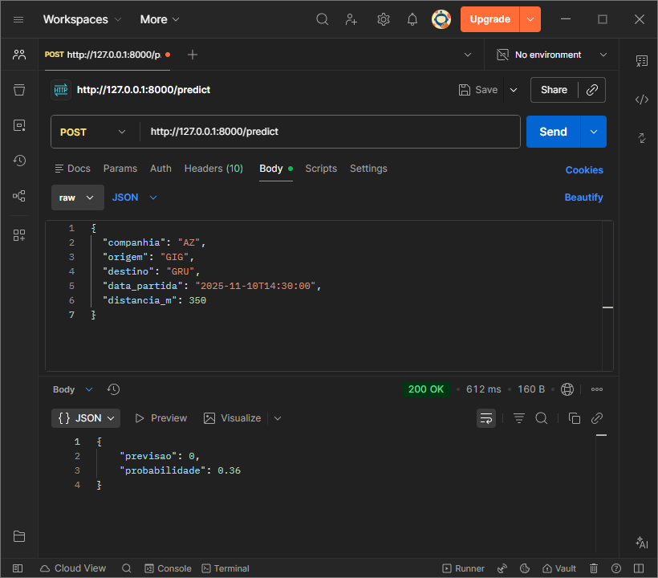

# Documentação da API PREDICT

**Arquivo:** `main.py`  
**Endpoint:** `/predict`  
**Método:** `POST`  
**Content-Type:** `application/json`

## Descrição

Este endpoint permite **prever a pontualidade de voos** com base na companhia aérea, aeroporto de origem, aeroporto de destino, data e hora da partida e distância entre os aeroportos.

A API recebe uma requisição JSON e retorna uma resposta JSON contendo:


- **previsao**: status previsto do voo (0 ou 1) 
- **probabilidade**: probabilidade da previsão  

O endpoint foi desenvolvido usando **FastAPI** e **Pydantic**, garantindo validação automática do corpo da requisição e estrutura do retorno.

## Autenticação

Este endpoint é protegido por **token de autenticação**.

O token deve ser enviado **no header da requisição**:

Requisições sem o token ou com token inválido retornarão **HTTP 401 (Unauthorized)**.

## Configuração

A API utiliza **variável de ambiente** para autenticação.

Crie um arquivo `.env` na raiz do projeto com base no `.env_example`.

O arquivo `.env` não é versionado e já está incluído no `.gitignore`.

O valor de `PREDICTION_API_TOKEN` deve ser um token secreto gerado previamente e
configurado também no backend Java, sendo enviado no header `Authorization` das requisições.

## Inicialização

Para inicializar o servidor, execute o comando abaixo:

```bash
uvicorn API.main:app --reload
```

## Requisição

**Método HTTP:** `POST`  
**URL:** `http://<seu-servidor>/predict`  

**Headers:**

```http
Content-Type: application/json
Authorization: Bearer <TOKEN>
```

**Exemplo de corpo da requisição:**
```JSON
{
  "companhia": "AZ",
  "origem": "GIG",
  "destino": "GRU",
  "data_partida": "2025-11-10T14:30:00",
  "distancia_m": 350
}
```

| Campo          | Tipo      | Descrição                                | Exemplo                |
|----------------|----------|-----------------------------------------|-----------------------|
| `companhia`    | string   | Código da companhia aérea               | `"AZ"`                |
| `origem`       | string   | Código do aeroporto de origem           | `"GIG"`               |
| `destino`      | string   | Código do aeroporto de destino          | `"GRU"`               |
| `data_partida` | datetime | Data e hora de partida no formato ISO   | `"2025-11-10T14:30:00"` |
| `distancia_km` | integer  | Distância entre origem e destino (km)   | `350`                 |

## Resposta

**Exemplo de corpo da resposta:**

```JSON
{
  "previsao": "Pontual",
  "probabilidade": 0.22
}
```

| Campo           | Tipo    | Descrição                                  | Exemplo      |
|-----------------|--------|-------------------------------------------|------------|
| `previsao`      | string | Status previsto do voo                     | `"Pontual"` |
| `probabilidade` | float  | Probabilidade da previsão (0 a 1)         | `0.22`      |

## Exemplo de Uso (Python)

```python
import requests

url = "http://127.0.0.1:8000/predict"

headers = {
    "authorization": "Bearer SEU_TOKEN_AQUI"
}

data = {
    "companhia": "AZ",
    "origem": "GIG",
    "destino": "GRU",
    "data_partida": "2025-11-10T14:30:00",
    "distancia_km": 350
}

response = requests.post(url, json=data)
print(response.json())
```

**Saída esperada:**

```JSON
{
  "previsao": 1,
  "probabilidade": 0.22
}
```

## Exemplo de Uso (Postman)



## Observações

- A API **valida automaticamente o corpo da requisição** usando Pydantic.  
- `data_partida` deve estar no **formato ISO 8601**: `YYYY-MM-DDTHH:MM:SS`.  
- `probabilidade` está sempre entre **0 e 1**.  
- Todas as requisições devem conter o header `Authorization`.
- O token é configurado via variável de ambiente no servidor.
